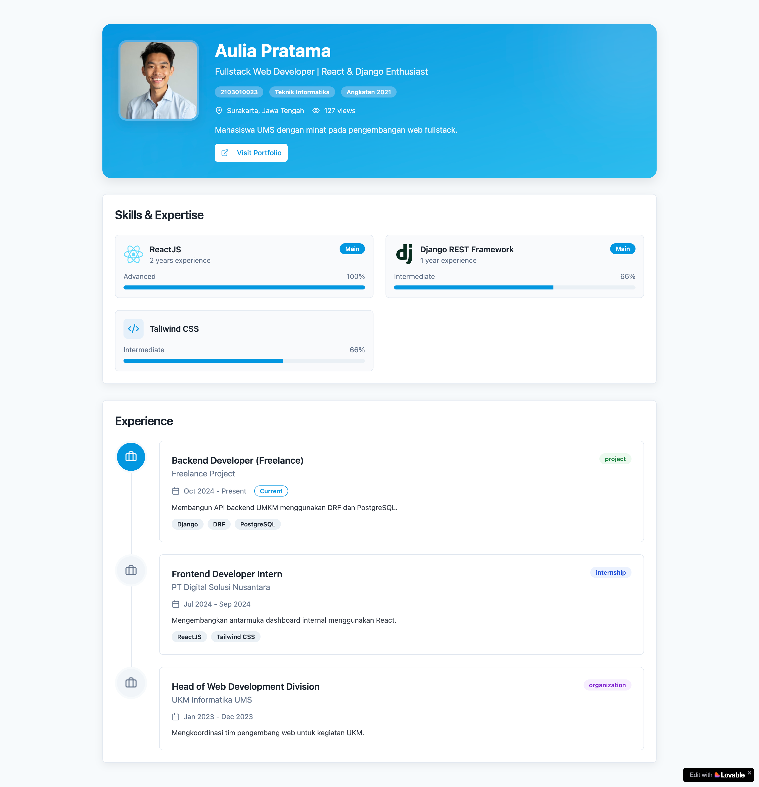

# 📄 ASSIGNMENT 1 – Single Page Application (SPA) using ReactJS to Display Student CV

**Course**: Web Programming with Framework  
**Assignment Type**: Individual  
**Deadline**: Friday, 28 November 2025 – 23.59 WIB  
**Deployment**: Vercel or Netlify  
**Submission**: GitHub Classroom

---

## 🧩 Task Description

This assignment requires you to build a Single Page Application (SPA) using ReactJS to display a Student CV. The application must contain three main sections:

1. Profile  
2. Skills  
3. Experiences  

A sample student data file is provided in JSON format. You MUST replace all sample content with your own personal data (name, student ID, photo, skills, experiences, etc.).  

The application should be simple, neat, and easy to use.

---

## 📦 Main Requirements

### 1. Application Development
- Must use ReactJS (Vite or Create React App allowed).  
- The application must be a Single Page Application.  
- Must contain at least three sections:
  - Profile  
  - Skills  
  - Experiences  
- Student data must be stored in a separate file (JS/JSON) and imported. This data **must be read automatically**, not hardcoded inside components.  
  The data structure is provided in the file `dataMahasiswa.json`.

### 2. Minimum Components
- `Profile.jsx`
- `Skills.jsx`
- `Experiences.jsx`
- `App.jsx`

### 3. Coding Rules
- Clean and modular folder structure.  
- Components must be separated and reusable.  
- Use any styling method (CSS, Tailwind, Bootstrap, etc.).

### 4. Documentation
You MUST include a `DOC.md` file containing:
- Application description  
- How to run the project  
- Deployment link  
- Screenshots  

---

## 🚀 Deployment (REQUIRED)

Students must deploy their application to one of the following platforms:

### Option 1 – Vercel
1. Open https://vercel.com  
2. Login with GitHub  
3. Import your assignment repository  
4. Wait for the build to finish  
5. Copy the deployment URL  

### Option 2 – Netlify
1. Open https://netlify.com  
2. Login with GitHub  
3. Add new site → Import from Git  
4. Select your assignment repository  
5. Wait for the build to finish  
6. Copy the deployment URL  

### Deployment Requirements
- Deployment link must be active & publicly accessible  
- Deployment link must be included in `DOC.md`  

---

## 📤 Submission
1. Submission is done through GitHub Classroom.  
2. Make sure your commits are incremental — not a single large commit.  
3. The number and quality of commits will affect your grade.  
4. **Deadline**: Friday, 28 November 2025 at 23.59 WIB  

---
## Example Implementation
Below is an example implementation of this assignment.

---

Good luck and do your best! 🚀
